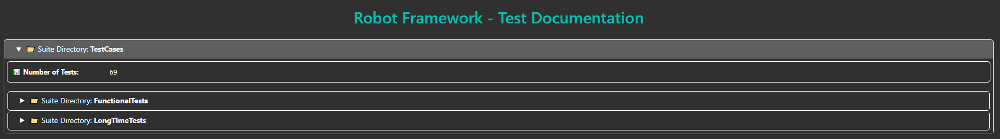
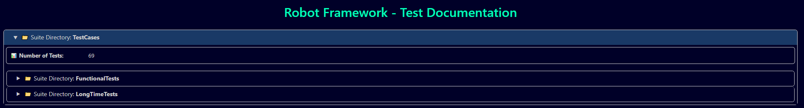
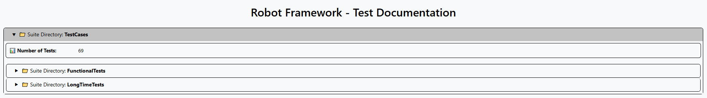

# robotframework-testdoc

The new tool to generate test documentation pages for your Robot Framework project.

## GitHub Project

Visit the project at [GitHub - robotframework-testdoc](ttps://github.com/MarvKler/robotframework-testdoc)

## Documentation

Visit the official documentation for more details: [Documentation - robotframework-testdoc](https://marvkler.github.io/robotframework-testdoc/)

## Statistics

[](https://github.com/MarvKler/robotframework-testdoc/actions/workflows/release.yml)  
[](https://pypi.org/project/robotframework-testdoc)   
[](https://pypi.org/project/robotframework-testdoc)    
[](https://pepy.tech/projects/robotframework-testdoc)   
[](https://pepy.tech/projects/robotframework-testdoc)   

## Installation

Install the tool using the following command:
```shell
pip install robotframework-testdoc
```

## Usage

### Basic Usage
```shell
testdoc suite_directory output.html
# or
testdoc suite_file output.html
```

### Extended Usage
```shell
testdoc [OPTIONS] suite_directory output.html
```

> [!TIP]
> **Included Help:** Visit the [CLI Documentation](https://marvkler.github.io/robotframework-testdoc/cli/cli/) for further arguments & details.

### Plugin Usage

You can use the testdoc tool also as plugin integration.  
You have two option to use it this way:
1. You can write your own HTML page as ``jinja2`` template, add this HTML template as CLI argument while generating the docs and you will get your own HTML style as documentation page.
2. You can use the ``mkdocs`` integration to define your own mkdcs template as CLI argument and the testdoc tool will internally take care of the mkdocs page generation.

For further details about the usage, please read the [official documentation](https://marvkler.github.io/robotframework-testdoc/usage).

## Examples

Visit the official documentation to find some [Examples](https://marvkler.github.io/robotframework-testdoc/usage/#examples).

## External Configuration File
The idea of the external configuration file is, having a central place for passing the known CMD arguments via file instead of CMD parameters.   
This will keep your CMD line call simple & clean.

For using this config file, just call the following command:
```shell
# Generate docu with options defined in TOML file
testdoc -c path/to/config.toml tests/ TestDocumentation.html
```

### pyproject.toml vs. custom toml file

Using the ``pyproject`` requires to define the ``testdoc`` sections with the prefix ``tool.``   
Example section start: ``[tool.testdoc]``

Using your own custom toml-file, does not require you to use the prefix. Here, you can just use ``[testdoc]`` as section header.


### Example Configuration File
```toml
[tool.testdoc]
title = "New title of HTML document"
name = "New name of root suite element"
doc = "New doc text of root suite element"
sourceprefix = "gitlab::https://gitlab.com/myrepo/repo_path"
include = ["TagA", "TagB"]
exclude = ["TagC"]
hide_tags = true
hide_test_doc = true
hide_suite_doc = true
hide_source = true
hide_keywords = true
style = "blue"
verbose_mode = false

[tool.testdoc.metadata]
Author = "Your-Name"
Version = "1.0.0"
Source = "AnySourceAsMetaData"

[tool.testdoc.colors]
# Use predefined theme:
default = "blue"
# OR
# Use custom colors:
background = "#000028"
inner_color = "#000028"
button_active_color = "#193966"
button_hover_color = "#193966"
border_color = "#CCCCCC"
text_color = "#CCCCCC"
title_color = "#00ffb9"
robot_icon = "#00ffb9"
code_area_background = "#303030"
code_area_foreground = "#f1f1f1"
```

## Theme Selection / Color Configuration

You can select between several themes (color configurations) for your HTML document to create!

> [!CAUTION]
> This is only possible via toml-configuration file, but not via cmd args directly!

### Default Themes

There are a few predefined default themes available that you can choose via the toml-configuration file OR cli.   
Therefore, please use the following syntax: for the toml file
```toml
[colors]
# Use the default theme
default = "default"
default = 0
# Use the dark theme
default = "dark"
default = 1
# Use the blue theme
default = "blue"
default = 2
# Use the robot theme
default = "robot"
default = 3
# Use the dark robot theme
default = "robot_dark"
default = 4
# Use the green theme
default = "green"
default = 5
```

For setting it via CLI, please use the following:
```shell
# Applying dark theme
testdoc ... -S dark PATH OUTPUT_FILE

# Applying blue theme
testdoc ... --style blue PATH OUTPUT_FILE
```

> [!TIP]
> You can select the default theme using either a string value or an integer value.

### Custom Themes

You can apply your own custom theme to modify the colors of the created HTML document.   
Use the following syntax & parameters in your toml-configuration file, to overwrite the predefined themes:
```toml
[colors]
background = "#000028"
inner_color = "#000028"
button_active_color = "#193966"
button_hover_color = "#193966"
border_color = "#CCCCCC"
text_color = "#CCCCCC"
title_color = "#00ffb9"
robot_icon = "#00ffb9"
code_area_background = "#303030"
code_area_foreground = "#f1f1f1"
```

> [!TIP]
> Please make sure to configure all available color values from this example — missing values may cause layout or rendering issues in the generated HTML document!

### Default Themes - Screenshot

#### Dark



#### Blue



#### Robot / Default



## Contribution & Development

See [Development.md](./DEVELOPMENT.md) for more information about contributing & developing this library.