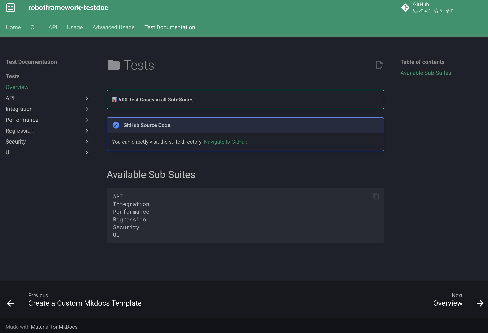
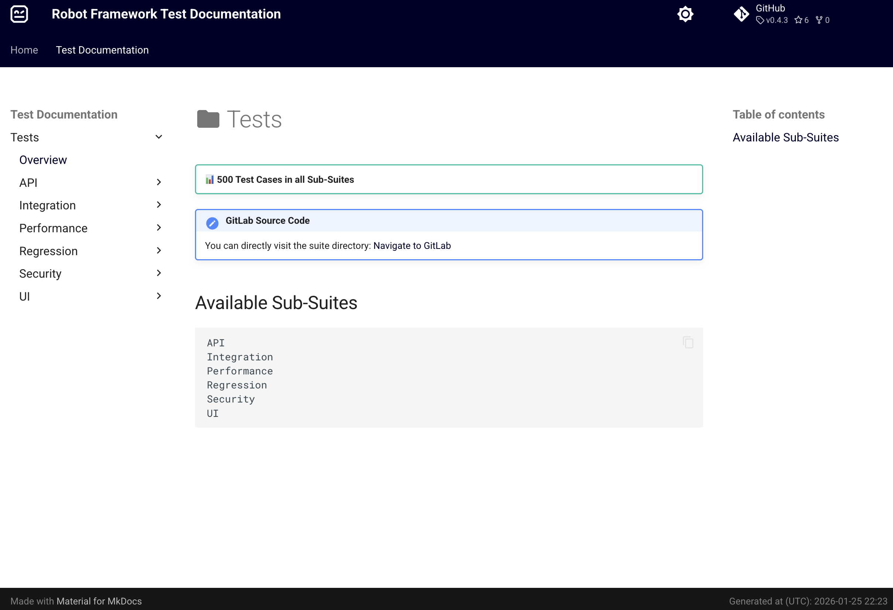
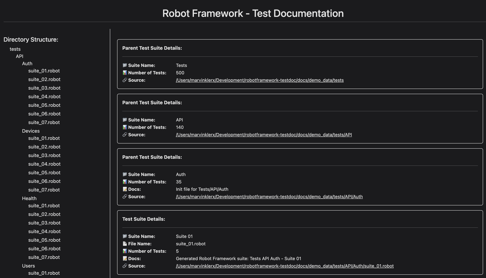

# :material-test-tube: Examples

## Integrate testdoc into your existing documentation

You can use testdoc to integrate the Robot Framework test documentation into your existing documentation via mkdocs. You just need to pass the path to your existing mkdocs template to testdoc.

!!! success "First Success Story"
    Actually this webpage, for the official documentation for ``robotframework-testdoc``, is generated by ``testdoc`` itself!

    But why ? For this documentation i am using static markdown files written for mkdocs. Now, ``testdoc`` is parsing a RF suite directory with demo data, it attaches the parsed data to the static page configuration & generates a common mkdocs webpage for it. Just navigate to the tab [Test Documentation](./generated/tests.md) and you will see a ready-to-read test documentation for a Robot Framework suite directory. This is a real world use case about integrating testdoc into existing mkdocs projects!

!!! example "Example 01: Test Documentation integrated into Static Documentation"
    

??? example "CLI Command"
    ```bash
    testdoc --mkdocs --mkdocs-template-dir docs/mkdocs docs/demo_data/tests .
    ```

## Generate new Test Documentation with mkdocs

The following screenshot shows a test documentation generated from scratch without any integration into an existing documentation. In this case, testdoc has used its internal default mkdocs template!

!!! tip "Tip"
    Of course you can also write your own mkdocs template to customize the design, colors, etc...

!!! example "Example 02: Generate a new Mkdocs Documentation"
    

??? example "CLI Command"
    ```bash
    testdoc --mkdocs docs/demo_data/tests .
    ```

## Generate new Test Documentation with Jinja2

This screenshot shows a test documentation generated from scratch using the internal default template for Jinja2.

!!! tip "Tip"
    You can also write your own customized jinja2 template that can be used by testdoc to generate the documentation in your custom style!

!!! example "Example 03: Documentation via Jinja2"
    

??? example "CLI Command"
    ```bash
    testdoc docs/demo_data/tests .
    ```