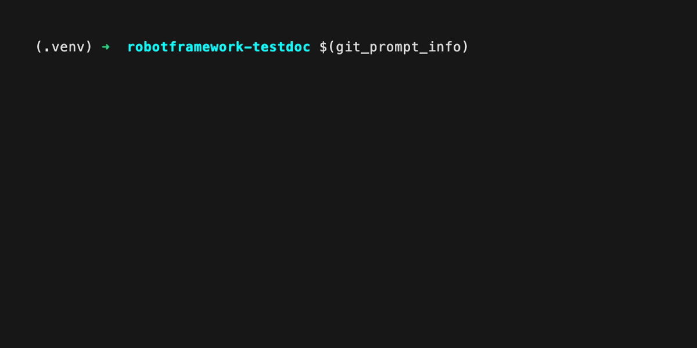
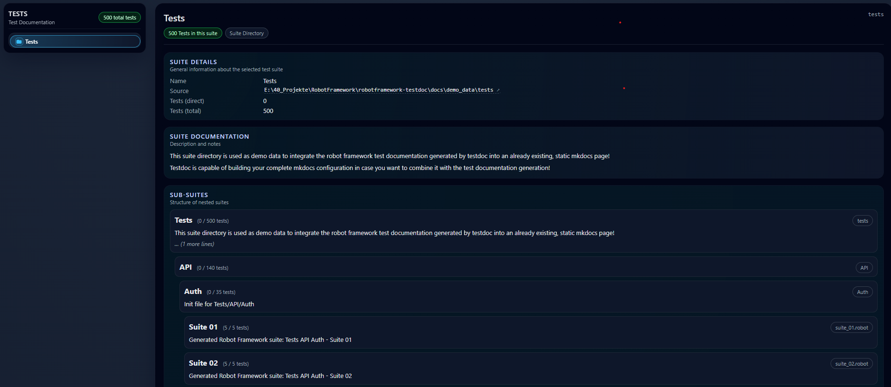
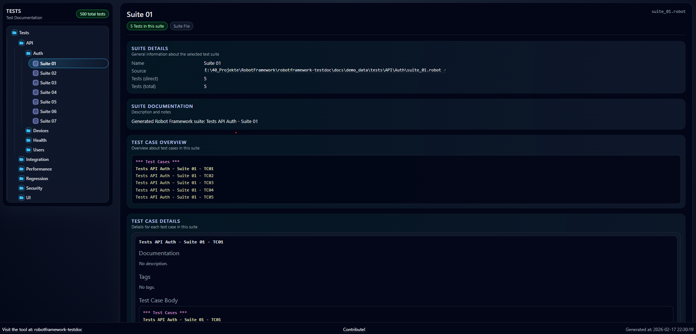

# Using Jinja2 Template

Jinja2 can be used to create generic HTML templates that contains variables as placeholders which are getting filled during the rendering process. With that you can create your own custom HTML pages without any static data, because the data gets filled automatically at runtime.

``robotframework-testdoc`` parses your given suite directory and fills the given jinja2 template with the parsed data.

You can choose between:

1. Using the predefined internal jinja2 template provided by testdoc
2. Writing your own jinja2 template & attach it as CLI argument to the testdoc execution

!!! tip "Default Behaviour"
    testdoc will always use the internal jinja2 template as default template unless you specify something else!

## Internal Jinja2 Template

The tool ``robotframework-testdoc`` provides an internal ``jinja2`` template which can be found here: [Internal Jinja2 Template](https://github.com/MarvKler/robotframework-testdoc/blob/main/src/testdoc/html/templates/v2/jinja_template_03.html).

Execute the following command to generate a test documentation using this predefined template:
```bash
testdoc suite_directory output/testdocumentation.html
```

## External Jinja2 Template

You can also create your own ``jinja2`` template & pass it into the ``testdoc`` tool via CLI argument:

```bash
testdoc --custom-jinja-template <path>/my_jinja2_template.html suite_directory output/testdocumentation.html
```

!!! tip "Read the API Documentation"
    Please read the [API Documentation](../api/api.md) before creating your custom template - you must know which metadata gets provided by ``testdoc`` to be used in the jinja2 template!

!!! tip "Example"
    Please take a look at the [Internal Jinja2 Template](https://github.com/MarvKler/robotframework-testdoc/blob/main/src/testdoc/html/templates/v2/jinja_template_03.html) to get an idea about using the provided metadata by ``testdoc``!



## Open Jinja2 Webpages

You can simply open the defined output HTML file in any browser on your local system. Jinja2 generates a static HTML pages without any dependecies.

!!! tip "Host a CI/CD Webpage"
    You also can host this generated output HTML file as static page in your CI/CD environment, e.g. as ``GitLab Page`` or ``GitHub Page``.

## Example HTML Page via Jinja2

Below you can see two examples how your test documentation will look when generating it using the internal jinja2 template:



